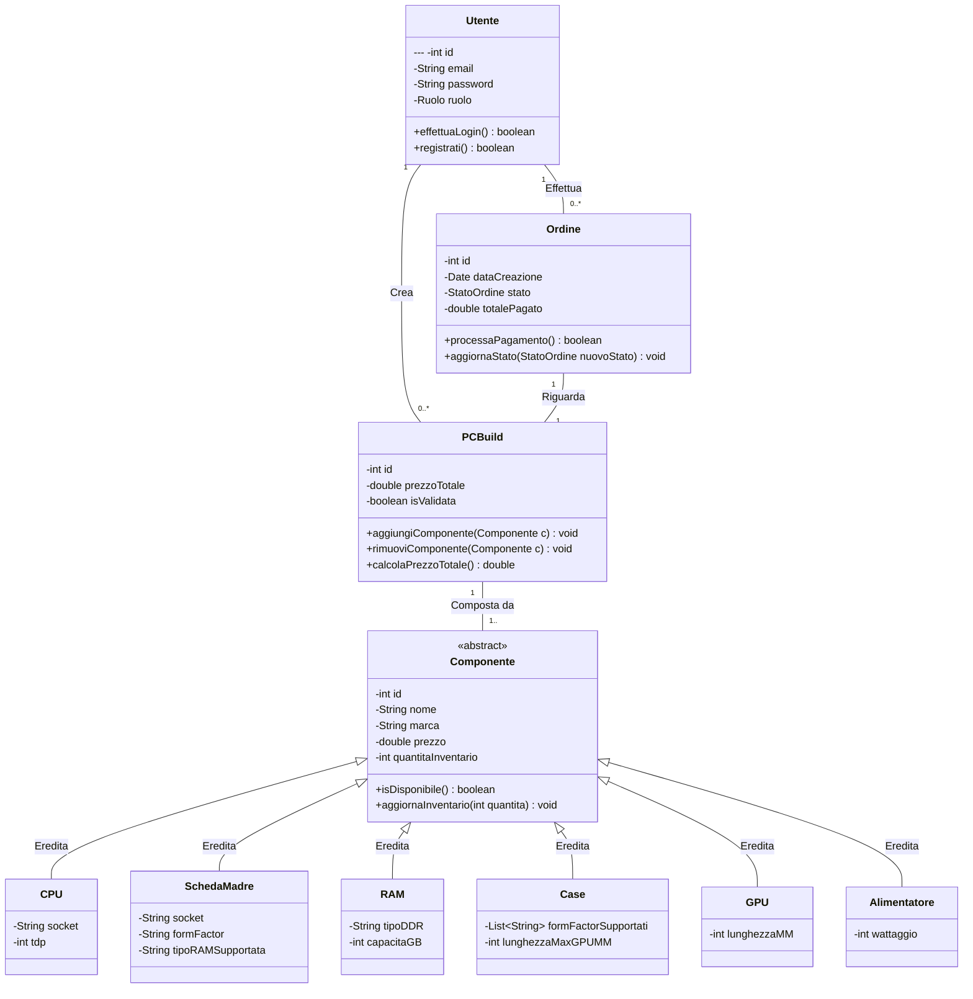

```mermaid

classDiagram
    %% Definizione delle classi base
    class Utente {
---        -int id
        -String email
        -String password
        -Ruolo ruolo
        +effettuaLogin() boolean
        +registrati() boolean
    }

    class PCBuild {
        -int id
        -double prezzoTotale
        -boolean isValidata
        +aggiungiComponente(Componente c) void
        +rimuoviComponente(Componente c) void
        +calcolaPrezzoTotale() double
    }

    class Ordine {
        -int id
        -Date dataCreazione
        -StatoOrdine stato
        -double totalePagato
        +processaPagamento() boolean
        +aggiornaStato(StatoOrdine nuovoStato) void
    }

    %% Definizione della superclasse Componente e delle sue sottoclassi
    class Componente {
        <<abstract>>
        -int id
        -String nome
        -String marca
        -double prezzo
        -int quantitaInventario
        +isDisponibile() boolean
        +aggiornaInventario(int quantita) void
    }

    class CPU {
        -String socket
        -int tdp
    }

    class SchedaMadre {
        -String socket
        -String formFactor
        -String tipoRAMSupportata
    }

    class RAM {
        -String tipoDDR
        -int capacitaGB
    }

    class Case {
        -List~String~ formFactorSupportati
        -int lunghezzaMaxGPUMM
    }

    class GPU {
        -int lunghezzaMM
    }

    class Alimentatore {
        -int wattaggio
    }

    %% Relazioni tra le classi
    Componente <|-- CPU : Eredita
    Componente <|-- SchedaMadre : Eredita
    Componente <|-- RAM : Eredita
    Componente <|-- Case : Eredita
    Componente <|-- GPU : Eredita
    Componente <|-- Alimentatore : Eredita

    PCBuild "1" -- "1.." Componente : Composta da
    Utente "1" -- "0..*" PCBuild : Crea
    Utente "1" -- "0..*" Ordine : Effettua
    Ordine "1" -- "1" PCBuild : Riguarda


```

